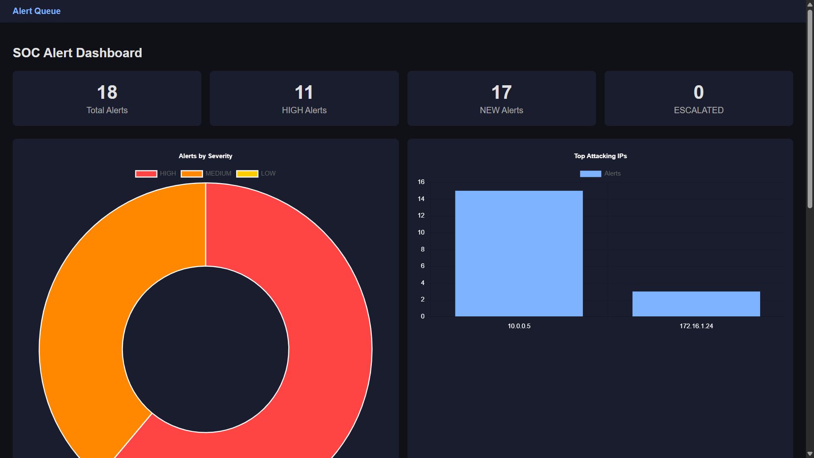
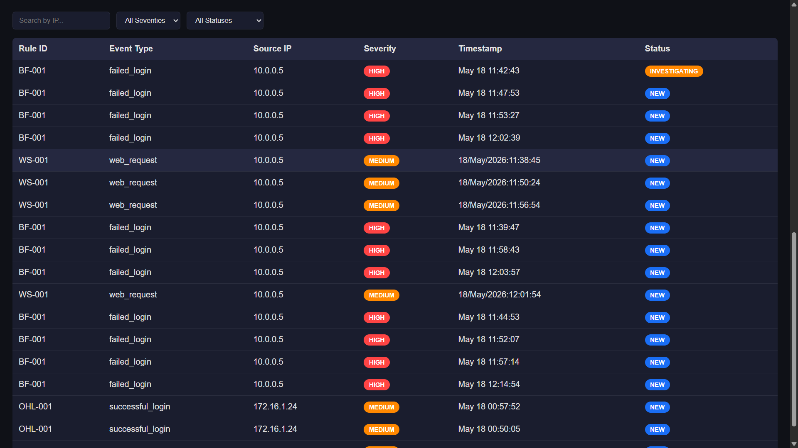
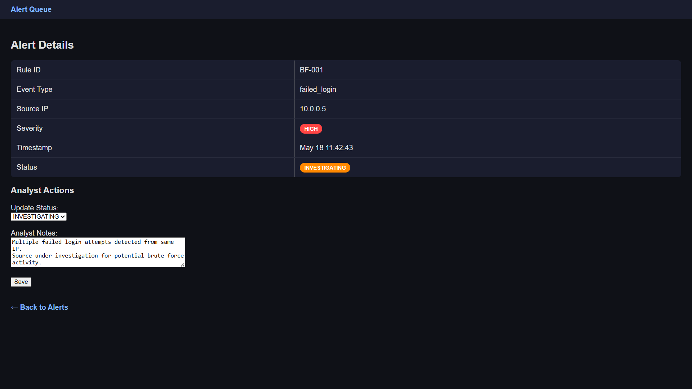

## SIEM System Project

A Python-based mini SIEM (Security Information and Event Management) system designed to simulate basic SOC (Security Operations Center) workflows.

## Features

- Log ingestion from:
  
  - Linux auth logs
  - Apache access logs

- Regex-based parsing and normalization

- Synthetic attack log generation

- Detection engine with configurable rules

- SQLite alert storage

- Flask-based SOC dashboard

- Alert status tracking and analyst notes

## Detection Rules

## - Brute Force Login
  
  - Detects multiple failed logins from same IP within time window

## - Off-Hours Login
  
  - Detects successful logins between 00:00–05:00

## - Web Scanning Activity
  
  - Detects repeated HTTP 404 requests from same IP

## Tech Stack

- Python
- Flask
- SQLite
- HTML/CSS/JavaScript
- Chart.js

## Project Workflow

Log Generator
    ↓
Log Ingestion
    ↓
Parsing & Normalization
    ↓
Detection Engine
    ↓
SQLite Storage
    ↓
SOC Dashboard

## Dashboard Features

- Alert queue
- Severity badges
- Alert status management
- Analyst investigation notes
- Severity distribution chart
- Top attacking IP chart
- Filtering by IP, severity, and status

## How to Run

## 1. Generate logs
## 2. Run Flask dashboard:

python app.py

## 3. Open:

http://127.0.0.1:5000/alert

## Learning Outcome

- Built a modular Python project structure
- Implemented log parsing and normalization
- Created rule-based threat detection
- Used SQLite for persistent alert storage
- Developed a Flask dashboard for SOC workflows

## Screenshots

### Dashboard Overview

### Alert Queue

### Alert Investigation Workflow
