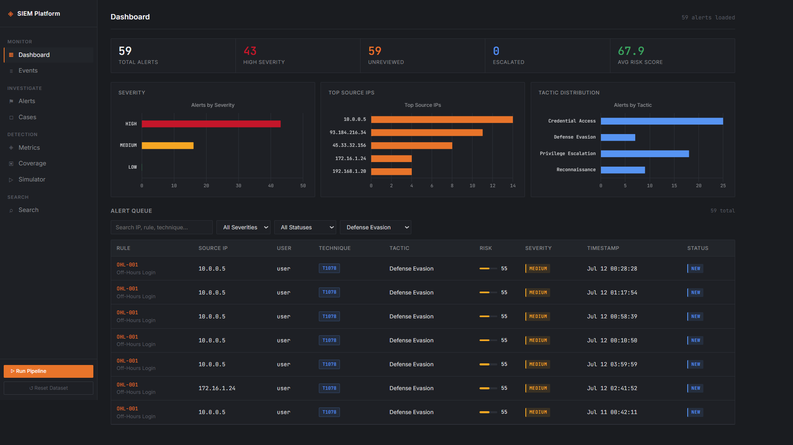
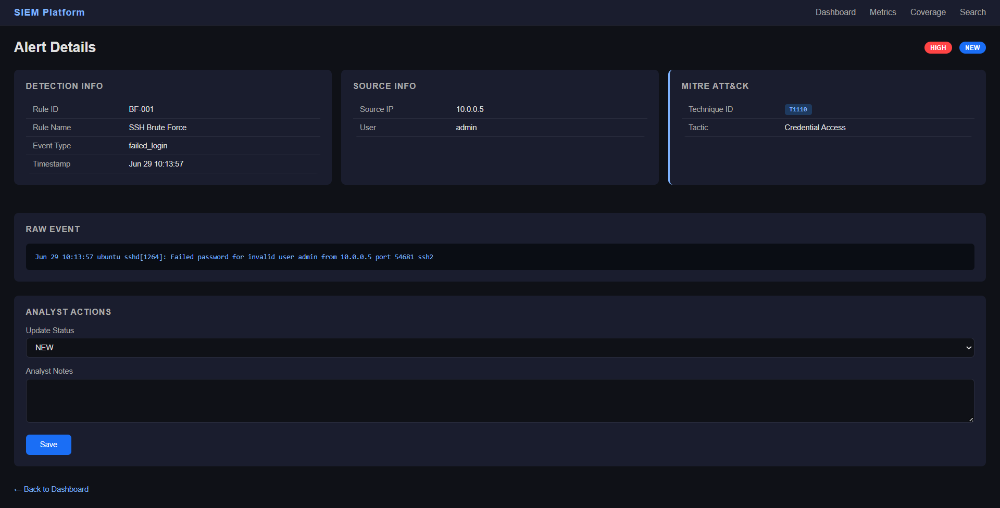
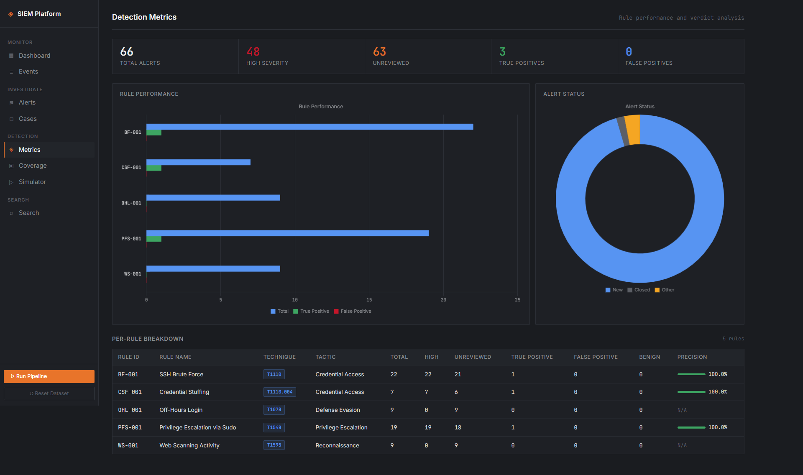
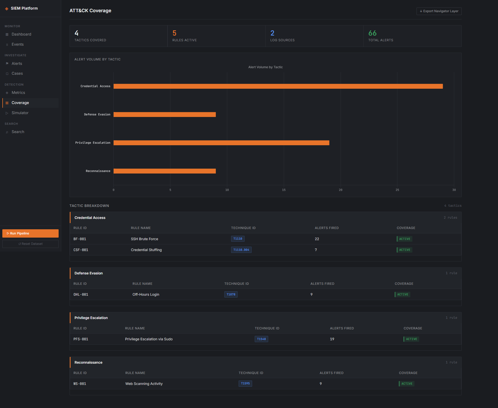
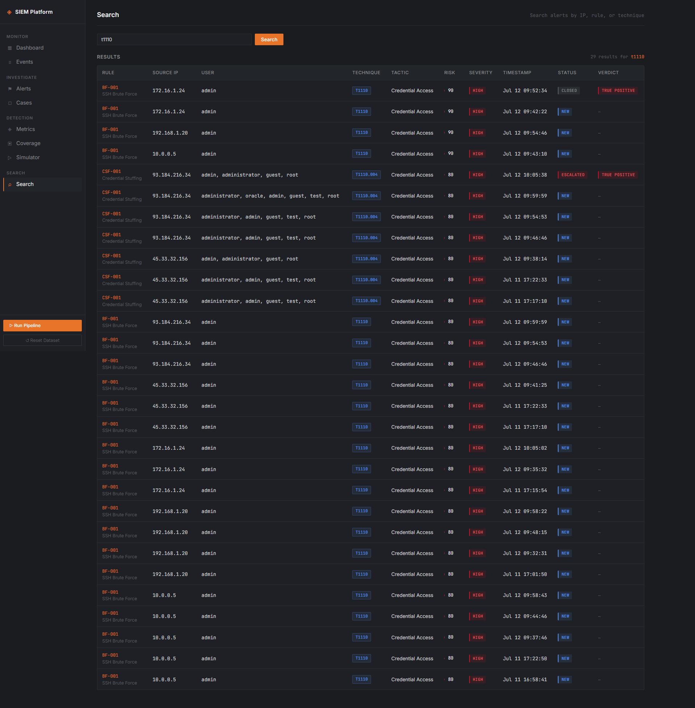

# SIEM System Project

A Python and Flask project that simulates a basic Security Operations Center (SOC). The project reads log files, detects suspicious activities using detection rules, and displays alerts in a web dashboard.

## Features

* Read Linux authentication logs (`auth.log`)
* Read Apache web access logs (`access.log`)
* Parse and normalize logs into a common event format
* Detect suspicious activity using JSON-based detection rules
* Store alerts in a SQLite database
* View alerts in a Flask web dashboard
* Search alerts by IP address, rule, or MITRE technique
* Update alert status and add analyst notes
* View detection metrics and MITRE ATT&CK coverage

---

## Log Processing Pipeline

```
Logs
   │
   ▼
Ingest
   │
   ▼
Parse
   │
   ▼
Normalize
   │
   ▼
Detect
   │
   ▼
Generate Alert
   │
   ▼
Investigate
```

Each alert also stores the original raw log line, so every detection can be traced back to its source.

---

## Supported Log Sources

### Linux Authentication Logs (`auth.log`)

The system can detect events such as:

* SSH login attempts
* Failed SSH logins
* Successful SSH logins
* sudo command execution
* su activity

### Apache Access Logs (`access.log`)

The system can detect:

* HTTP requests
* Status codes
* Requested URLs
* Source IP addresses

---

## Detection Rules

| Rule ID | Rule Name                     | MITRE Technique | Tactic               | Trigger                                                                       |
| ------- | ----------------------------- | --------------- | -------------------- | ----------------------------------------------------------------------------- |
| BF-001  | SSH Brute Force               | T1110           | Credential Access    | 5 or more failed logins from one IP within 60 seconds                         |
| OHL-001 | Off-Hours Login               | T1078           | Defense Evasion      | Successful login between 00:00 and 05:00                                      |
| WS-001  | Web Scanning Activity         | T1595           | Reconnaissance       | 10 or more HTTP 404 responses from one IP within 30 seconds                   |
| PFS-001 | Privilege Escalation via sudo | T1548           | Privilege Escalation | Any sudo command execution                                                    |
| CSF-001 | Credential Stuffing           | T1110.004       | Credential Access    | Failed logins for 3 or more different usernames from one IP within 60 seconds |

---

## Project Structure

```
SIEM-System-Project/
│
├── config.py
├── requirements.txt
│
├── Data/
│   └── Logs/
│       ├── auth.log
│       └── access.log
│
├── Generators/
│   ├── auth_log_generator.py
│   └── access_log_generator.py
│
├── Ingestion/
│   └── reader.py
│
├── Parsing/
│   ├── parser.py
│   └── normalization.py
│
├── Detection/
│   ├── engine.py
│   └── rules.json
│
├── Storage/
│   └── store.py
│
└── Dashboard/
    ├── app.py
    ├── static/
    │   ├── style.css
    │   └── script.js
    │
    └── templates/
        ├── layout.html
        ├── index.html
        ├── alert_details.html
        ├── metrics.html
        ├── coverage.html
        └── search.html
```

---

## Installation

Clone the repository:

```bash
git clone <your-repository-url>
cd SIEM-System-Project
```

Create a virtual environment:

```bash
python -m venv .venv
```

Activate the virtual environment.

Windows:

```bash
.venv\Scripts\activate
```

Linux or macOS:

```bash
source .venv/bin/activate
```

Install the required packages:

```bash
pip install -r requirements.txt
```

---

## Usage

### Step 1: Generate Logs

```bash
python Generators/auth_log_generator.py
python Generators/access_log_generator.py
```

### Step 2: Start the Dashboard

```bash
python Dashboard/app.py
```

### Step 3: Open the Application

Open your browser and go to:

```
http://127.0.0.1:5000
```

When the dashboard starts, the system automatically:

* Reads log files
* Parses log events
* Normalizes the data
* Runs all detection rules
* Stores new alerts in SQLite

Existing alerts are not duplicated when the page is refreshed.

---

## Dashboard Pages

| Route         | Description                                                                   |
| ------------- | ----------------------------------------------------------------------------- |
| `/`           | Main dashboard with alerts, charts, and filters                               |
| `/alert/<id>` | Alert details, MITRE information, raw event, status update, and analyst notes |
| `/metrics`    | Detection statistics for each rule                                            |
| `/coverage`   | MITRE ATT&CK tactic and technique coverage                                    |
| `/search`     | Search alerts by IP address, rule ID, rule name, or MITRE technique           |

---

## Alert Status

Each alert follows this workflow:

```
NEW
   │
   ▼
INVESTIGATING
   │
   ▼
ESCALATED
   │
   ▼
CLOSED
```

Analysts can change the alert status and add investigation notes from the alert details page.

---

## Technologies Used

* Python 3.10+
* Flask
* SQLite3
* Jinja2
* Chart.js

---

# Screenshots

## Dashboard



## Alert Details



## Metrics



## MITRE Coverage



## Search


