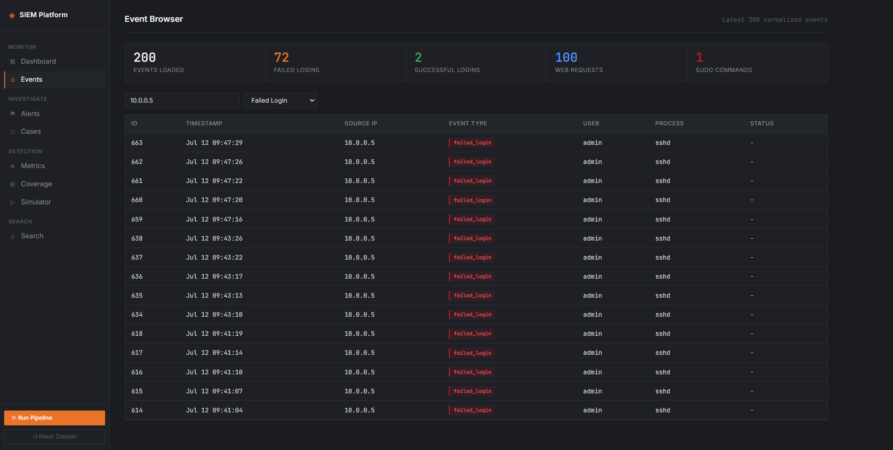
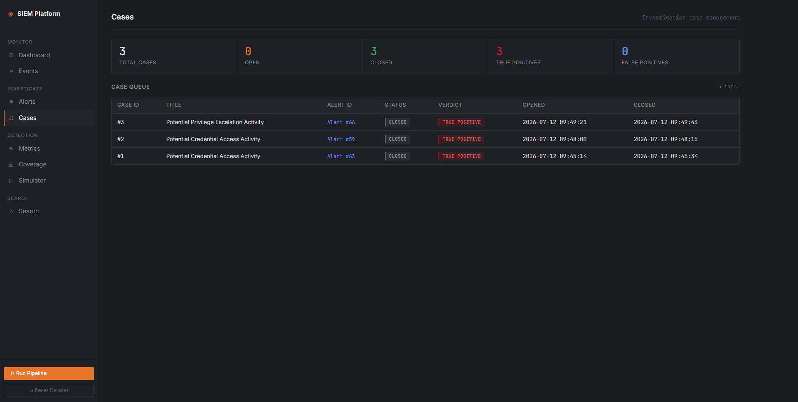
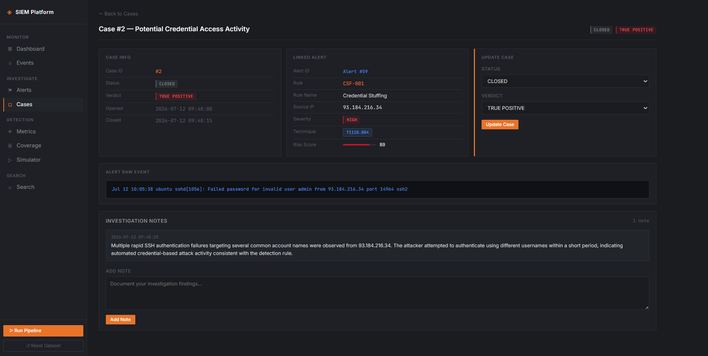

# SIEM System Project

A Python and Flask application that simulates a Security Operations Center (SOC)
workflow. It ingests Linux authentication and Apache access logs, normalizes them
into a unified event model, runs MITRE ATT&CK-mapped detection rules, assigns risk
scores to alerts, and provides a web interface for investigation, case management,
and detection reporting.

---

## Screenshots

### Dashboard


### Alert Investigation


### Events Browser



### Cases



### Case Details



### Detection Metrics


### ATT&CK Coverage


### Search


---

## Architecture


---

## Features

- Linux authentication and Apache access log ingestion
- Event normalization into a unified event model
- Five MITRE ATT&CK-mapped detection rules with a JSON rule repository
- Alert risk scoring based on severity, timing, user context, and source IP history
- Alert-to-event correlation — every alert links to the raw log events that triggered it
- Event Browser for investigating normalized telemetry independently of alerts
- Alert triage with status tracking, analyst notes, and verdict assignment
- Case management with timestamped investigation notes
- Detection Rule Simulator using the same production detection pipeline
- True Positive, False Positive, and precision tracking per rule
- MITRE ATT&CK coverage dashboard with Navigator layer export
- AI-assisted investigation summaries supporting Anthropic, OpenAI, and Google

---

## Detection Rules

| Rule ID | Rule Name | Technique | Tactic | Trigger |
|---------|-----------|-----------|--------|---------|
| BF-001 | SSH Brute Force | T1110 | Credential Access | 5+ failed SSH logins from one IP within 60 seconds |
| OHL-001 | Off-Hours Login | T1078 | Defense Evasion | Successful login between 00:00 and 05:00 |
| WS-001 | Web Scanning Activity | T1595 | Reconnaissance | 10+ HTTP 404 responses from one IP within 30 seconds |
| PFS-001 | Privilege Escalation via sudo | T1548 | Privilege Escalation | Any sudo command execution |
| CSF-001 | Credential Stuffing | T1110.004 | Credential Access | Failed logins against 3+ usernames from one IP within 60 seconds |

Rules are stored in `Detection/rules.json` and include severity, rule type,
technique, and tactic. Adding a new rule requires only a JSON file — no Python
changes needed.

---

## Risk Scoring

Every alert receives a risk score between 0 and 100 at detection time.

The score is calculated from four factors:

- **Base score** from alert severity — HIGH starts at 70, MEDIUM at 40, LOW at 15
- **+15** if the alert occurred between 00:00 and 05:00
- **+10** if the targeted user is root, admin, or administrator
- **+10** if the source IP has 3 or more previous alerts in the database

The score is capped at 100 and displayed throughout the dashboard to help
prioritize which alerts to investigate first.

---

## Project Structure

```text
SIEM-System-Project/
├── config.py                # All paths and settings
├── requirements.txt
├── Data/                    # Log files
├── Generators/              # Synthetic log generators
├── Ingestion/               # Log file reader
├── Parsing/                 # Log parsers and event normalization
├── Detection/               # Detection engine and rules.json
├── Storage/                 # SQLite database operations
└── Dashboard/               # Flask app, templates, and static files
```

---

## Database Schema

| Table | Description |
|-------|-------------|
| `events` | Every normalized event from log processing, stored independently of alerts |
| `alerts` | Detection results with severity, risk score, status, verdict, and MITRE mapping |
| `alert_events` | Maps each alert to the specific events that triggered it |
| `cases` | Investigation cases created from alerts, with independent status tracking |
| `notes` | Timestamped analyst notes attached to cases |

Events and alerts are stored separately so analysts can investigate raw telemetry
even when no detection rule triggers.

---

## Installation

```bash
git clone <your-repository-url>
cd SIEM-System-Project

python -m venv .venv

# Windows
.venv\Scripts\activate

# Linux / macOS
source .venv/bin/activate

pip install -r requirements.txt
```

---

## Usage

### Step 1 — Generate sample logs

```bash
python Generators/auth_log_generator.py
python Generators/access_log_generator.py
```

### Step 2 — Start the dashboard

```bash
python Dashboard/app.py
```

### Step 3 — Open the application

```text
http://127.0.0.1:5000
```

Click **Run Pipeline** in the sidebar to ingest logs, run detection, and populate
the dashboard. The pipeline can be run again after generating additional logs —
duplicate events and alerts are automatically prevented.

---

## Dashboard Routes

| Route | Description |
|-------|-------------|
| `/` | Alert dashboard with charts, risk scores, and alert queue |
| `/events` | Browse all normalized events with type filtering |
| `/events/<id>` | Single event detail with pivot links to related alerts |
| `/alert/<id>` | Alert detail with evidence, linked events, verdict, and case management |
| `/cases` | Investigation case list with status and verdict |
| `/cases/<id>` | Case detail with notes, verdict, and linked alert context |
| `/metrics` | Per-rule detection metrics including TP, FP, and precision |
| `/coverage` | MITRE ATT&CK coverage dashboard |
| `/search` | Search alerts by IP, rule ID, rule name, or technique |
| `/simulator` | Test individual log lines against detection rules |
| `/coverage/export` | Export ATT&CK Navigator layer JSON |
| `/run` | Trigger the detection pipeline |
| `/reset` | Clear all investigation data |

---

## Alert Lifecycle

```text
Open Case → Investigation Notes → Verdict → Case Closed
```

Each case links to one alert and maintains its own status independently.

Closing a case records the closure timestamp automatically.

---

## AI Investigation Assistant

The alert detail page includes an AI assistant that generates investigation
guidance from alert context.

It supports three providers:

| Provider | Example Model |
|----------|---------------|
| Anthropic | claude-sonnet-4-6 |
| OpenAI | gpt-4o |
| Google | gemini-2.5-flash |

The provider, model name, and API key are entered in the UI.

No keys are stored anywhere — each request uses the key once and discards it.

---

## Technology Stack

- Python 3.10+
- Flask
- SQLite3
- Jinja2
- Chart.js
- MITRE ATT&CK
- ATT&CK Navigator